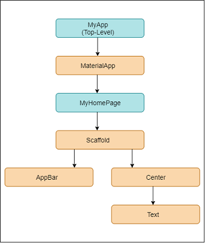
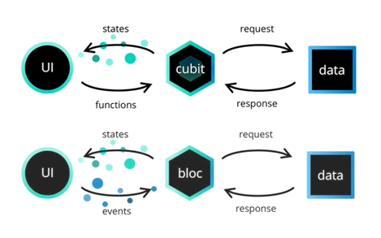
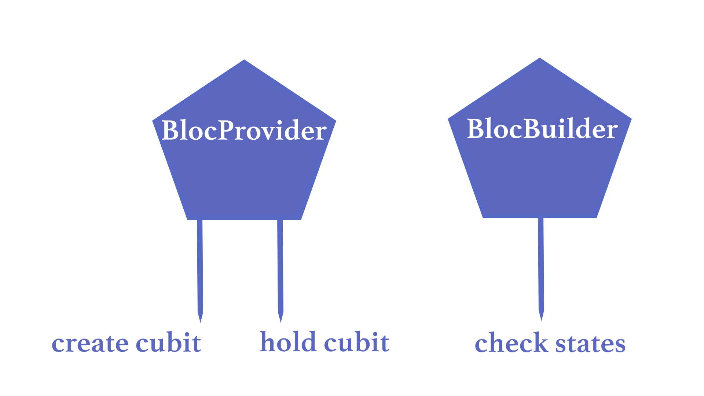
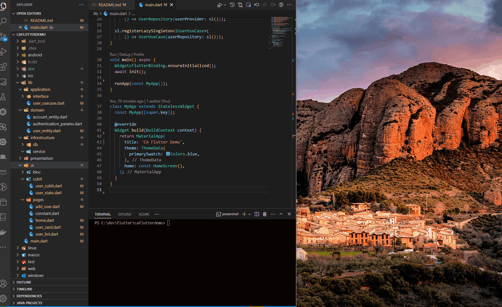
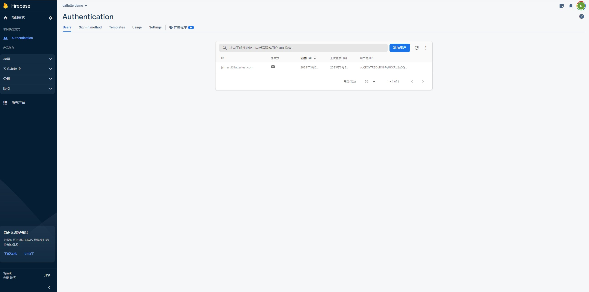

# caflutterdemo

# CA Flutter Demo

## Install Flutter & Android Studio

check following url for installing flutter and android studio
https://www.youtube.com/watch?v=03zuAxPjVDI

## Tech Stack

- [x] Clean Architecture
- [x] BLoC (events/states)
- [x] Get_It (DI)
- [x] Cubit
- [x] Android Studio
- [x] json to form (json schema)
- [x] http / dio
- [ ] Unit Test [TODO]
- [ ] Offline first [TODO]
- [x] Authentication
- [x] Firebase DB

## Flutter

- Flutter is Cross-Platform.
- Flutter is a UI toolkit and SDK which you can use to build applications. Flutter is open source and you can use it to build highly performant mobile and desktop apps.



## State Management

BLOC/Cubit



- The best way to keep your code organized, clean, and maintainable in Flutter is to have a component that can mediate what the user sees and its logic. This component is Bloc (Business Logic Component.)




- The Cubit is a subset of the famous implementation of BLoC Pattern: bloclibrary.dev, it abandons the concept of Events and simplifies the way of emitting states. A Cubit is just a class that extends (inherits) from BlocBase, and due to its definition, it always requires an initial state. If we don’t specify the state type, the state is assumed automatically to be of type dynamic.

## vscode extension

- flutter
- dart
- Pubspec Assist
- bloc
- Flutter Widget Snippets

http://dartpad.dev

```powershell
# install flutter

# install android studio

# check flutter
$ flutter doctor

# create project
$ flutter create caflutterdemo

# add simple form builder
$ flutter pub add simple_form_builder
# json to form
$ flutter pub add json_to_form

# firebase
$ flutter pub add firebase_core
$ flutter pub add firebase_auth

# flutter build
$ flutter build apk

# flutter clean
$ flutter clean

# run flutter
$ cd caflutterdemo
$ flutter run
$ flutter run <DART_FILE>

# or with --no-sound-null-safety
$ flutter run --no-sound-null-safety

# choose chrome/edge

# emulator (android studio - float mode)

```

## Run with Emulator



## Debug (F5)

## Setup for firebase

default login email: jefftest@fluttertest.com, password: 12345678



https://www.youtube.com/watch?v=aKgEEnVhU1I

https://www.youtube.com/watch?v=GvIoBgmNgQw

## Getting Started

This project is a starting point for a Flutter application.

A few resources to get you started if this is your first Flutter project:

- [Lab: Write your first Flutter app](https://docs.flutter.dev/get-started/codelab)
- [Cookbook: Useful Flutter samples](https://docs.flutter.dev/cookbook)

For help getting started with Flutter development, view the
[online documentation](https://docs.flutter.dev/), which offers tutorials,
samples, guidance on mobile development, and a full API reference.
